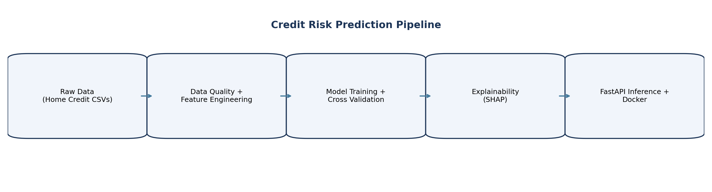
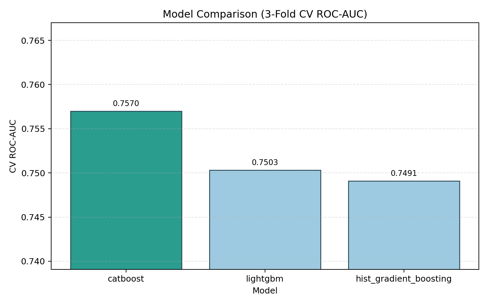
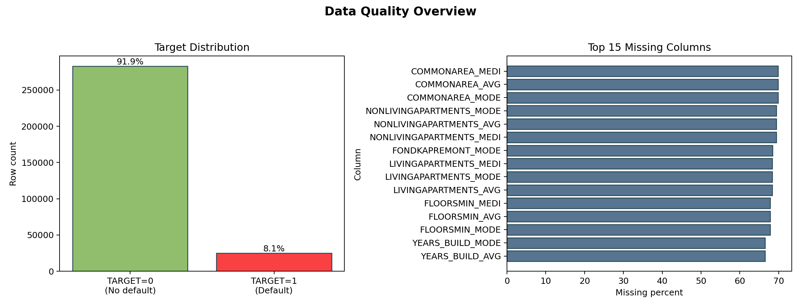
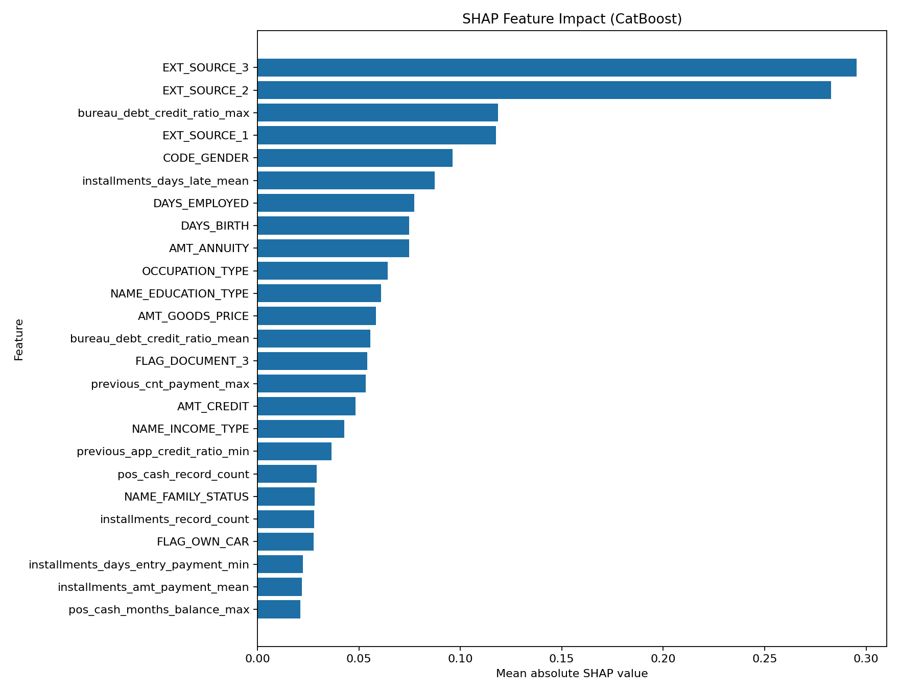

# Credit Risk Prediction System (Home Credit)

This repository is a beginner-friendly, end-to-end machine learning project for credit default risk prediction.

It is written as a tutorial-style project, so you can learn each stage of a real tabular ML workflow:

1. Data loading and feature engineering
2. Baseline model training
3. Cross-validation and model comparison
4. Explainability with SHAP
5. Inference API for deployment

## Project status

This version is complete and GitHub-ready.

Implemented in this version:

- Baseline training pipeline with applicant + aggregated secondary-table features
- Stratified CV metrics and model comparison (HGB, LightGBM, CatBoost)
- Explainability report generation (CatBoost default)
- Portfolio-ready matplotlib figures (pipeline, model comparison, data quality, SHAP)
- FastAPI prediction service
- Docker deployment files

## Who this is for

- Beginners learning practical ML project structure
- Portfolio project for data science and ML engineering
- Users who want both notebooks (learning) and scripts (reproducible runs)

## Repository structure

```text
home-credit-default-risk/
  data/
    raw/                  # Place original Kaggle/Home Credit CSV files here (not committed)
    processed/            # Cached engineered tables (not committed)
  notebooks/
    01_starter_overview.ipynb
  outputs/
    models/               # Trained model artifacts (not committed)
    predictions/          # Submission/prediction CSVs (not committed)
  reports/                # Generated JSON/CSV/figures (mostly not committed)
  src/
    credit_risk/
      api.py
      config.py
      data.py
      data_quality.py
      explainability.py
      features.py
      model_compare.py
      predict.py
        report_figures.py
      secondary_features.py
      train.py
  build_aggregated_features.py
  compare_models.py
  generate_data_report.py
  generate_explainability_report.py
      generate_project_figures.py
  predict_baseline.py
  serve_api.py
  train_baseline.py
  Dockerfile
  requirements.txt
```

## Important note about data

The dataset CSV files are ignored in Git because they are large.

Before running anything, copy your Home Credit CSV files into:

- data/raw/application_train.csv
- data/raw/application_test.csv
- data/raw/bureau.csv
- data/raw/bureau_balance.csv
- data/raw/credit_card_balance.csv
- data/raw/installments_payments.csv
- data/raw/POS_CASH_balance.csv
- data/raw/previous_application.csv
- data/raw/sample_submission.csv
- data/raw/HomeCredit_columns_description.csv

## Environment setup

1. Create and activate a virtual environment.
2. Install dependencies.

```bash
pip install -r requirements.txt
```

## Tutorial workflow (recommended order)

### Step 1) Build aggregated features cache

```bash
python build_aggregated_features.py --force
```

### Step 2) Train baseline model

```bash
python train_baseline.py
```

Outputs:

- outputs/models/baseline_hgb.joblib
- reports/baseline_metrics.json

### Step 3) Generate baseline predictions

```bash
python predict_baseline.py
```

Output:

- outputs/predictions/submission_baseline.csv

### Step 4) Run model comparison

```bash
python compare_models.py
```

Outputs:

- reports/model_comparison.json
- reports/model_comparison.csv

### Step 5) Generate explainability report

Default (CatBoost explainer):

```bash
python generate_explainability_report.py
```

Optional:

```bash
python generate_explainability_report.py --model catboost
python generate_explainability_report.py --model lightgbm
python generate_explainability_report.py --model auto
```

Outputs:

- reports/explainability_summary.json
- reports/explainability_top_features.csv
- reports/figures/shap_summary_bar.png

### Step 6) Generate data quality report

```bash
python generate_data_report.py
```

Outputs:

- reports/data_quality_report.json
- reports/application_train_missingness.csv
- reports/application_train_dtypes.csv

### Step 7) Generate presentation figures (matplotlib)

```bash
python generate_project_figures.py
```

Outputs:

- reports/figures/pipeline_overview.png
- reports/figures/model_comparison_auc.png
- reports/figures/data_quality_overview.png
- reports/figures/shap_summary_bar.png

## Project figures

End-to-end pipeline overview:



Model comparison (3-fold CV ROC-AUC):



Data quality overview (class balance + missingness):



Explainability summary (SHAP mean absolute impact):



## Run the API locally

Start server:

```bash
uvicorn serve_api:app --host 0.0.0.0 --port 8000 --reload
```

Endpoints:

- GET /health
- GET /schema
- POST /predict

Example request:

```bash
curl -X POST "http://127.0.0.1:8000/predict" \
  -H "Content-Type: application/json" \
  -d '{"records":[{"EXT_SOURCE_2":0.7,"EXT_SOURCE_3":0.6,"AMT_CREDIT":500000}]}'
```

## Deploy with Docker

Build image:

```bash
docker build -t credit-risk-api .
```

Run container:

```bash
docker run --rm -p 8000:8000 credit-risk-api
```

Optional model override:

```bash
docker run --rm -p 8000:8000 \
  -e CREDIT_RISK_MODEL_PATH=/app/outputs/models/baseline_hgb.joblib \
  credit-risk-api
```

## Notebook usage

Use notebooks/01_starter_overview.ipynb for exploration and learning.

Use src scripts for reproducible pipeline runs.

## Metrics note for beginners

- TARGET = 1 means higher default risk.
- ROC-AUC near 1.0 is better; 0.5 is random-like ranking.
- SHAP mean_abs_shap ranks feature impact magnitude on model output.

## GitHub push commands

If starting from scratch on a new machine:

```bash
git init
git add .
git commit -m "Initial commit: credit risk pipeline"
git branch -M main
git remote add origin <YOUR_GITHUB_REPO_URL>
git push -u origin main
```

## Next improvements

1. Hyperparameter tuning and experiment tracking
2. Model monitoring and drift checks
3. CI workflow (tests + lint on pull requests)
